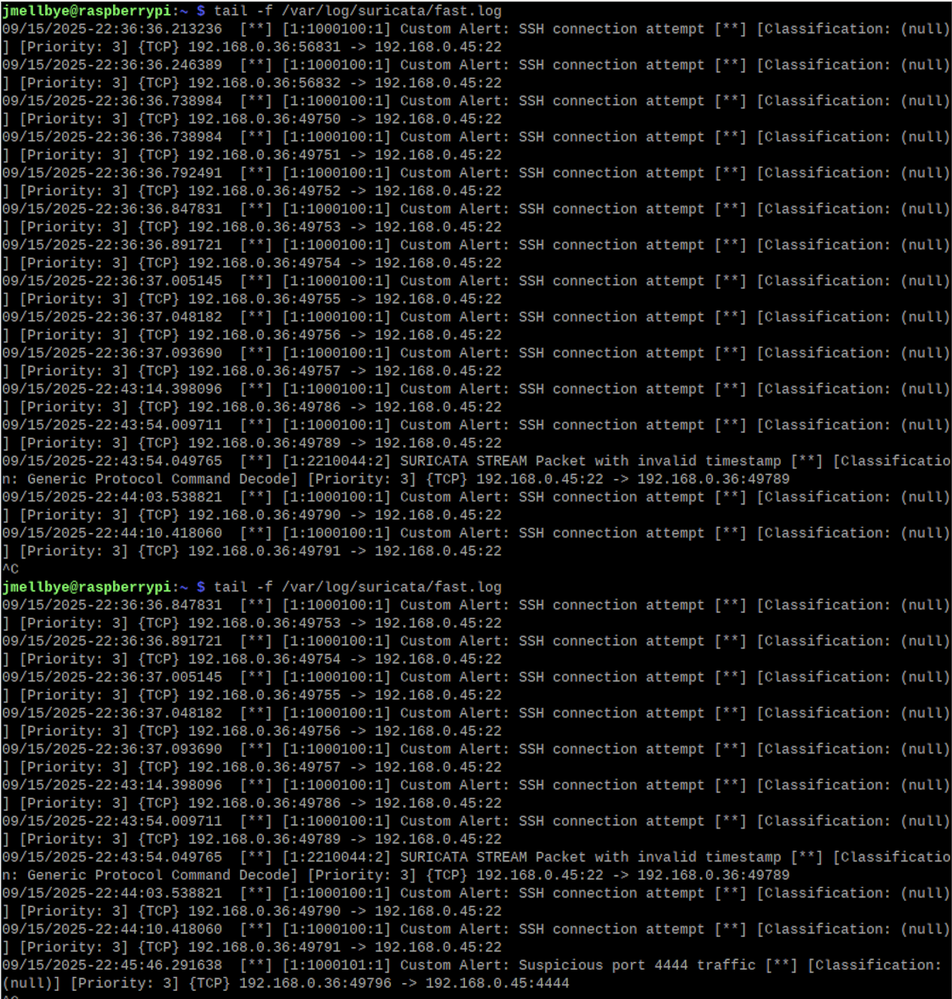

# Intrusion Detection Project (Raspberry Pi + Suricata)

Suricata + Raspberry Pi Screenshot

## Overview

This project demonstrates how to use a **Raspberry Pi** as a lightweight **Intrusion Detection System (IDS)**.  
The IDS monitors traffic, applies both **default Suricata rules** and **custom rules**, and logs suspicious activity.

The goal was to detect simulated anomalies such as port scans, SSH attempts, and traffic to unusual ports.

---

## Setup

### Hardware
- Raspberry Pi 5 
- SD card 32GB
- Ethernet connection
- MacBook Pro (attacker/test client)

### Software
- Raspberry Pi OS Lite (Bookworm)
- Suricata 6.x
- nmap, netcat (for testing)
- jq (for JSON log parsing)

### Suricata Configuration
- **HOME_NET:** `192.168.0.0/24`
- **default-rule-path:** `/var/lib/suricata/rules`
- **rule-files:**
  ```yaml
  rule-files:
    - suricata.rules
    - custom.rules
  ```
- **outputs:**
  ```yaml
  outputs:
    - fast:
        enabled: yes
        filename: fast.log
        append: yes
  ```

📷 *Screenshot: systemctl status suricata*  
📷 *Screenshot: suricata -T showing both suricata.rules and custom.rules loaded*  

---

## Custom Rules

Two simple custom rules were created for controlled testing:

```text
alert tcp any any -> any 22 (msg:"Custom Alert: SSH connection attempt"; sid:1000100; rev:1;)
alert tcp any any -> any 4444 (msg:"Custom Alert: Suspicious port 4444 traffic"; sid:1000101; rev:1;)
```

📷 *Screenshot: custom.rules in VS Code*  

## Step-by-Step Methodology (what was done and why)

### 1. Environment Setup
- Installed Suricata on a Raspberry Pi (`apt install suricata`).
- Configured `HOME_NET` to reflect the local network range.
- Verified installation with:
  ```bash
  sudo suricata -T -c /etc/suricata/suricata.yaml -v
  ```

**Why:** Ensures Suricata is installed and can parse rules.

---

### 2. Rule Configuration
- Downloaded default rules with `suricata-update`.
- Added custom rules for SSH and port 4444 probes.

**Why:** Validates IDS by simulating realistic attack traffic.

---

### 3. Simulated Traffic Tests
- **SSH Probe**
  ```bash
  nmap -sS -p22 <PI-IP>
  ```
  → Triggered *Custom SSH SYN* alert.

- **Port 4444 Probe**
  ```bash
  nc -vz <PI-IP> 4444
  ```
  → Triggered *Custom 4444 SYN* alert.

- **Full Port Scan**
  ```bash
  nmap -sS -p- <PI-IP>
  ```
  → Triggered multiple alerts (ET SCAN + custom rules).

- **ICMP Ping**
  ```bash
  ping -c 4 <PI-IP>
  ```
  → Logged as `flow` event in eve.json (no alert).

--- 

## Results
- **fast.log** captured alerts for SSH attempts and port 4444 probes.
- **eve.json** provided detailed logs with IPs, ports, and metadata.
- Ping and DNS correctly logged as flows without alerts.
- Nmap scans produced multiple alerts.

--- 

### Analysis



## Analysis of Results

The screenshot from `fast.log` confirms that the custom rules were triggered as expected:

- **SSH SYN alerts**: Multiple alerts labeled *Custom Alert: SSH connection attempt* were generated when running an Nmap SYN scan on port 22. Each entry corresponds to a SYN packet sent by the scanner. This validates that the IDS correctly identified repeated probes against the SSH service.

- **Port 4444 alerts**: The alert *Custom Alert: Suspicious port 4444 traffic* was triggered when testing access to TCP port 4444 using `nc`. This demonstrates how custom rules can highlight connections to unusual or high-risk ports that are often associated with malware or backdoors.

- **Other Suricata messages**: Lines such as *SURICATA STREAM Packet with invalid timestamp* were also observed. These originate from Suricata’s built-in stream engine and are not part of the custom rules. They highlight potential anomalies in TCP packet sequencing but can be considered noise in this controlled test.

Overall, the test results confirm that Suricata detects both common behavior (port scans, SSH attempts) and custom-defined suspicious behavior (port 4444), while still logging ping without triggering alerts.


---

## Key Learnings

- Suricata distinguishes between **flows** (all traffic) and **alerts** (rule matches).  
- Custom rules can be easily added for targeted detection.  
- IDS mode is safe for testing because it only logs, it does not block traffic.  
- YAML configuration must be correct (`default-rule-path`, indentation).  

---

## IDS vs IPS

Suricata also supports **IPS mode** (Intrusion Prevention System) where traffic can be blocked.  
For this project, IPS was **not enabled** because:
1. Inline IPS could disrupt legitimate traffic.
2. Raspberry Pi has limited performance overhead.

Instead, focus was kept on **IDS mode** for monitoring and alerting.

--- 
## Use of AI Assistance
During this project, ChatGPT was used as a supportive tool. The AI was primarily applied to:
- Provide step-by-step guidance for configuring Suricata on Raspberry Pi.
- Help create and refine custom rules for SSH and suspicious port traffic.
- Generate automation scripts (e.g., setting up rule files, structuring the GitHub repository).
- Draft and format the initial version of the README and documentation structure.

All testing, verification, and analysis of alerts were performed manually by me on the Raspberry Pi environment.
The AI was not used to run the IDS or simulate traffic but rather to accelerate learning, scripting, and documentation.

## References
- ChatGPT (OpenAI). (2025). Assistance with Suricata configuration and documentation.  
- Suricata Documentation: <https://suricata.io/documentation/>  
